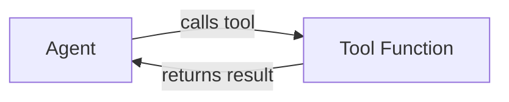
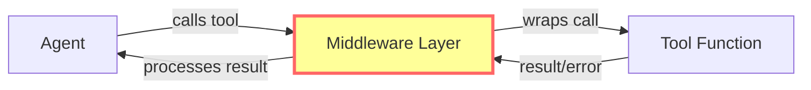
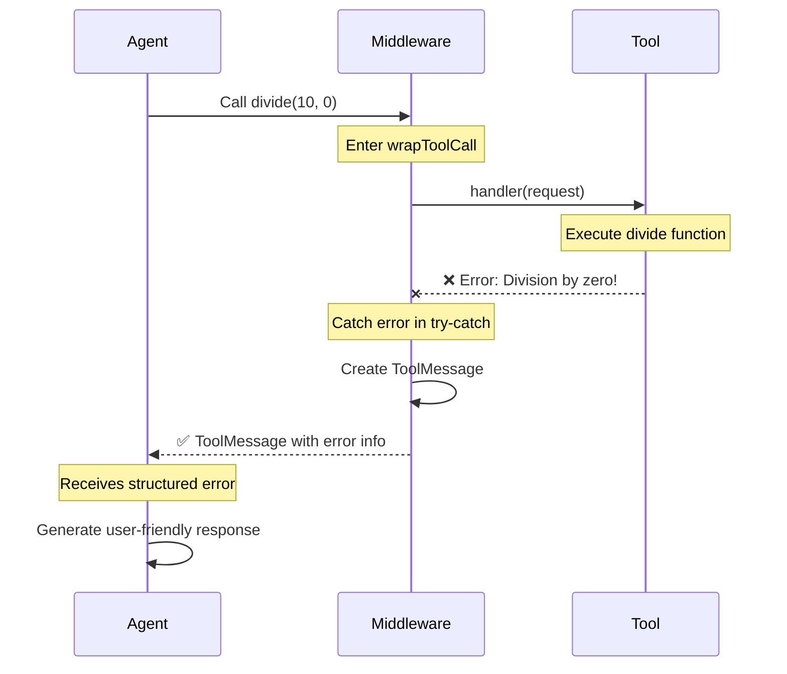
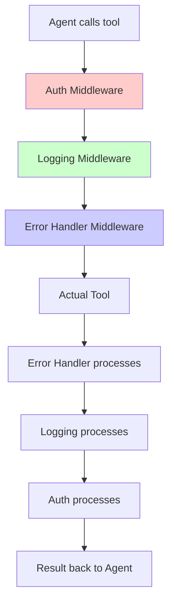

# Understanding Middleware in LangChain Agents

## 🎯 What is Middleware?

Middleware is a **wrapper pattern** that intercepts function calls to add extra behavior before, after, or around the original function execution.

## 🔄 Execution Flow

### Without Middleware


### With Middleware


## 🛠️ Your handleToolErrors Middleware

### Code Breakdown

```typescript
const handleToolErrors = createMiddleware({
    name: "HandleToolErrors",
    wrapToolCall: async (request, handler) => {
        try {
            // 1️⃣ BEFORE: Middleware receives the tool call request
            console.log("Middleware intercepted tool call:", request.toolCall.name);
            
            // 2️⃣ EXECUTE: Pass control to the actual tool
            return await handler(request);
            
            // 3️⃣ AFTER: If successful, return result as-is
        } catch (error) {
            // 4️⃣ ERROR HANDLING: Catch any errors from the tool
            console.log("Middleware caught error:", error);
            
            // 5️⃣ TRANSFORM: Convert error into a structured message
            return new ToolMessage({
                content: `Tool error: Please check your input and try again. (${error})`,
                tool_call_id: request.toolCall.id!,
            });
        }
    },
});
```

### Step-by-Step Execution



## 🎯 Why Use Middleware?

### 1. **Centralized Error Handling**

❌ **Without Middleware** - Handle errors in every tool:
```typescript
const add = tool(({ a, b }) => {
    try {
        return a + b;
    } catch (error) {
        return new ToolMessage({ content: `Error: ${error}` });
    }
});

const multiply = tool(({ a, b }) => {
    try {
        return a * b;
    } catch (error) {
        return new ToolMessage({ content: `Error: ${error}` });
    }
});

const divide = tool(({ a, b }) => {
    try {
        if (b === 0) throw new Error("Division by zero");
        return a / b;
    } catch (error) {
        return new ToolMessage({ content: `Error: ${error}` });
    }
});
```

✅ **With Middleware** - Handle errors once:
```typescript
// Tools are clean and focused
const add = tool(({ a, b }) => a + b, { ... });
const multiply = tool(({ a, b }) => a * b, { ... });
const divide = tool(({ a, b }) => {
    if (b === 0) throw new Error("Division by zero");
    return a / b;
}, { ... });

// Error handling in one place
const handleToolErrors = createMiddleware({
    wrapToolCall: async (request, handler) => {
        try {
            return await handler(request);
        } catch (error) {
            return new ToolMessage({
                content: `Tool error: ${error}`,
                tool_call_id: request.toolCall.id!,
            });
        }
    },
});
```

### 2. **Cross-Cutting Concerns**

Middleware is perfect for functionality that applies to **all tools**:

| Use Case | Example |
|----------|---------|
| **Logging** | Log every tool call with timestamp |
| **Performance** | Measure execution time of tools |
| **Authentication** | Check permissions before tool execution |
| **Rate Limiting** | Throttle tool calls to external APIs |
| **Caching** | Cache repeated tool calls |
| **Error Recovery** | Retry failed operations |
| **Telemetry** | Send metrics to monitoring systems |

### 3. **Separation of Concerns**

```typescript
// Business Logic (Tools)
const fetchUserData = tool(({ userId }) => {
    return database.getUser(userId);
});

// Cross-cutting concerns (Middleware)
const loggingMiddleware = createMiddleware({
    wrapToolCall: async (request, handler) => {
        console.log(`[${new Date().toISOString()}] Calling: ${request.toolCall.name}`);
        const result = await handler(request);
        console.log(`[${new Date().toISOString()}] Completed: ${request.toolCall.name}`);
        return result;
    }
});

const authMiddleware = createMiddleware({
    wrapToolCall: async (request, handler) => {
        if (!hasPermission(request.toolCall.name)) {
            throw new Error("Unauthorized");
        }
        return await handler(request);
    }
});

// Chain multiple middlewares
const agent = createAgent({
    model,
    tools: [fetchUserData],
    middleware: [authMiddleware, loggingMiddleware, handleToolErrors],
});
```

## 🔗 Middleware Chain

When you have multiple middlewares, they execute in a **nested** pattern:

```typescript
middleware: [auth, logging, errorHandler]
```



**Execution order:**
1. Auth checks permission ✅
2. Logging records start time ⏱️
3. Error handler wraps in try-catch 🛡️
4. Tool executes 🔧
5. Error handler catches any errors 🛡️
6. Logging records end time ⏱️
7. Auth logs access ✅

## 🎨 Common Middleware Patterns

### Pattern 1: Logging and Monitoring
```typescript
const loggingMiddleware = createMiddleware({
    name: "LoggingMiddleware",
    wrapToolCall: async (request, handler) => {
        const startTime = Date.now();
        console.log(`🔧 Tool: ${request.toolCall.name}`);
        console.log(`📥 Input:`, request.toolCall.args);
        
        const result = await handler(request);
        
        const duration = Date.now() - startTime;
        console.log(`✅ Completed in ${duration}ms`);
        console.log(`📤 Output:`, result);
        
        return result;
    }
});
```

### Pattern 2: Retry Logic
```typescript
const retryMiddleware = createMiddleware({
    name: "RetryMiddleware",
    wrapToolCall: async (request, handler) => {
        const maxRetries = 3;
        
        for (let i = 0; i < maxRetries; i++) {
            try {
                return await handler(request);
            } catch (error) {
                console.log(`Attempt ${i + 1} failed:`, error);
                if (i === maxRetries - 1) throw error;
                await new Promise(resolve => setTimeout(resolve, 1000 * (i + 1)));
            }
        }
    }
});
```

### Pattern 3: Input Validation
```typescript
const validationMiddleware = createMiddleware({
    name: "ValidationMiddleware",
    wrapToolCall: async (request, handler) => {
        // Check for null/undefined arguments
        if (!request.toolCall.args || Object.keys(request.toolCall.args).length === 0) {
            return new ToolMessage({
                content: "Error: No arguments provided to tool",
                tool_call_id: request.toolCall.id!,
            });
        }
        
        return await handler(request);
    }
});
```

### Pattern 4: Caching
```typescript
const cache = new Map();

const cachingMiddleware = createMiddleware({
    name: "CachingMiddleware",
    wrapToolCall: async (request, handler) => {
        const cacheKey = JSON.stringify({
            name: request.toolCall.name,
            args: request.toolCall.args
        });
        
        // Check cache
        if (cache.has(cacheKey)) {
            console.log("💾 Cache hit!");
            return cache.get(cacheKey);
        }
        
        // Execute and cache
        const result = await handler(request);
        cache.set(cacheKey, result);
        return result;
    }
});
```

## 📊 Benefits Summary

| Benefit | Description |
|---------|-------------|
| **DRY Principle** | Don't repeat error handling/logging in every tool |
| **Maintainability** | Change behavior in one place, affects all tools |
| **Testability** | Test middleware independently from tools |
| **Composability** | Stack multiple middlewares for complex behavior |
| **Clean Code** | Tools focus on business logic only |

## 🎓 Key Takeaways

1. **Middleware = Wrapper Pattern** - Intercepts and enhances function calls
2. **wrapToolCall** - The function that wraps every tool execution  
3. **handler(request)** - Executes the actual tool
4. **try-catch** - Catches errors from tools
5. **ToolMessage** - Structured error response the agent can understand
6. **Middleware Chain** - Multiple middlewares execute in nested order

---

Your `handleToolErrors` middleware makes your agent more **robust** and **user-friendly** by gracefully handling errors instead of crashing! 🚀
